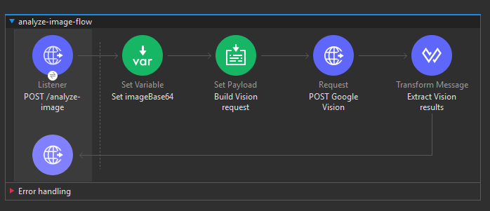
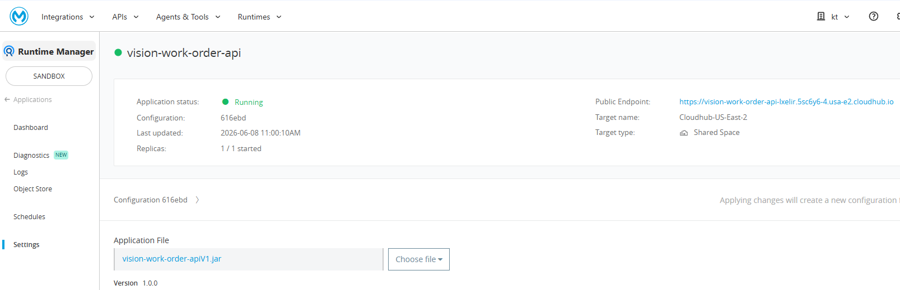

# vision-work-order-api — MuleSoft CloudHub


---

🇫🇷 [Français](#français) · 🇬🇧 [English](#english)

---

## Français

### À propos

API MuleSoft déployée sur **CloudHub** qui reçoit une image en base64, appelle **Google Cloud Vision API**, et retourne un JSON structuré contenant les labels détectés, le texte lu, et une suggestion de Work Order Salesforce.

Fait partie du projet [Vision Work Order LWC](https://github.com/KarterKiller/vision-work-order-lwc).

---

### Endpoint

```
POST /analyze-image
Content-Type: application/json

{
  "imageBase64": "<image en base64>",
  "fileName": "equipment.jpg"
}
```

**Réponse :**

```json
{
  "labels": [
    { "description": "Electronic device", "score": 0.88 },
    { "description": "Technology", "score": 0.86 }
  ],
  "detectedText": "HUAWEI EchoLife HG8010H",
  "workOrderSuggestion": {
    "subject": "Inspection — Electronic device",
    "description": "Équipement : Electronic device | Texte : HUAWEI EchoLife HG8010H | Google Vision AI",
    "equipmentType": "Electronic device",
    "serialNumber": "HUAWEI EchoLife HG8010H"
  }
}
```

### Captures d'écran

**Flow MuleSoft — Anypoint Studio**



**App déployée sur CloudHub**



---

### Architecture du flow

```
POST /analyze-image
        │
        ▼
Set Variable : imageBase64
        │
        ▼
Set Payload (DataWeave)
  → Construit la requête Google Vision
  → LABEL_DETECTION + TEXT_DETECTION
        │
        ▼
HTTP Request → vision.googleapis.com
  POST /v1/images:annotate?key={api_key}
        │
        ▼
EE Transform (DataWeave)
  → Extrait labels, texte détecté
  → Construit workOrderSuggestion
        │
        ▼
Réponse JSON au client
```

---

### Stack

| Composant | Technologie |
|---|---|
| Runtime | Mule 4.x |
| Déploiement | MuleSoft CloudHub (0.1 vCore) |
| Transformation | DataWeave 2.0 |
| API externe | Google Cloud Vision API v1 |
| Détections | LABEL\_DETECTION · TEXT\_DETECTION |

---

### Installation locale

#### Prérequis
- Anypoint Studio 7.x
- Compte Google Cloud avec Cloud Vision API activée
- Clé API Google Vision

#### 1 — Cloner et configurer

```bash
git clone https://github.com/KarterKiller/vision-work-order-api
cd vision-work-order-api
```

Configurer `src/main/resources/properties.yaml` :

```yaml
http:
  port: "8081"
google:
  vision:
    key: "VOTRE_CLE_API"
```

#### 2 — Lancer en local

Anypoint Studio → clic droit projet → **Run As → Mule Application**

#### 3 — Tester

```bash
curl -X POST http://localhost:8081/analyze-image \
  -H "Content-Type: application/json" \
  -d '{"imageBase64": "<votre_image_base64>", "fileName": "test.jpg"}'
```

#### 4 — Déployer sur CloudHub

Anypoint Studio → **Run → Deploy to CloudHub**
- App name : `vision-work-order-api`
- Runtime : 4.x
- Worker : 0.1 vCore

---

### Repos liés

| Repo | Description |
|---|---|
| [vision-work-order-lwc](https://github.com/KarterKiller/vision-work-order-lwc) | LWC Salesforce mobile qui appelle cette API |
| [account-enrichment-api](https://github.com/KarterKiller/account-enrichment-api) | API MuleSoft d'enrichissement Account (API gouv + NewsAPI) |
| [account360-agentforce](https://github.com/KarterKiller/account360-agentforce) | Projet Salesforce principal (Account 360 AI) |

---

## English

### About

A MuleSoft API deployed on **CloudHub** that receives a base64 image, calls **Google Cloud Vision API**, and returns a structured JSON containing detected labels, extracted text, and a Salesforce Work Order suggestion.

Part of the [Vision Work Order LWC](https://github.com/KarterKiller/vision-work-order-lwc) project.

---

### Endpoint

```
POST /analyze-image
Content-Type: application/json

{
  "imageBase64": "<base64 image>",
  "fileName": "equipment.jpg"
}
```

**Response:**

```json
{
  "labels": [
    { "description": "Electronic device", "score": 0.88 },
    { "description": "Technology", "score": 0.86 }
  ],
  "detectedText": "HUAWEI EchoLife HG8010H",
  "workOrderSuggestion": {
    "subject": "Inspection — Electronic device",
    "description": "Equipment: Electronic device | Text: HUAWEI EchoLife HG8010H | Google Vision AI",
    "equipmentType": "Electronic device",
    "serialNumber": "HUAWEI EchoLife HG8010H"
  }
}
``### Screenshots

**MuleSoft Flow — Anypoint Studio**


**App running on CloudHub**


---

### Flow Architecture

```
POST /analyze-image
        │
        ▼
Set Variable: imageBase64
        │
        ▼
Set Payload (DataWeave)
  → Builds Google Vision request
  → LABEL_DETECTION + TEXT_DETECTION
        │
        ▼
HTTP Request → vision.googleapis.com
  POST /v1/images:annotate?key={api_key}
        │
        ▼
EE Transform (DataWeave)
  → Extracts labels, detected text
  → Builds workOrderSuggestion
        │
        ▼
JSON response to client
```

---

### Stack

| Component | Technology |
|---|---|
| Runtime | Mule 4.x |
| Deployment | MuleSoft CloudHub (0.1 vCore) |
| Transformation | DataWeave 2.0 |
| External API | Google Cloud Vision API v1 |
| Detections | LABEL\_DETECTION · TEXT\_DETECTION |

---

### Local Setup

#### Prerequisites
- Anypoint Studio 7.x
- Google Cloud account with Cloud Vision API enabled
- Google Vision API key

#### 1 — Clone and configure

```bash
git clone https://github.com/KarterKiller/vision-work-order-api
cd vision-work-order-api
```

Configure `src/main/resources/properties.yaml`:

```yaml
http:
  port: "8081"
google:
  vision:
    key: "YOUR_API_KEY"
```

#### 2 — Run locally

Anypoint Studio → right-click project → **Run As → Mule Application**

#### 3 — Test

```bash
curl -X POST http://localhost:8081/analyze-image \
  -H "Content-Type: application/json" \
  -d '{"imageBase64": "<your_base64_image>", "fileName": "test.jpg"}'
```

#### 4 — Deploy to CloudHub

Anypoint Studio → **Run → Deploy to CloudHub**
- App name: `vision-work-order-api`
- Runtime: 4.x
- Worker: 0.1 vCore

---

### Related Repos

| Repo | Description |
|---|---|
| [vision-work-order-lwc](https://github.com/KarterKiller/vision-work-order-lwc) | Salesforce mobile LWC that calls this API |
| [account-enrichment-api](https://github.com/KarterKiller/account-enrichment-api) | MuleSoft Account enrichment API (API gouv + NewsAPI) |
| [account360-agentforce](https://github.com/KarterKiller/account360-agentforce) | Main Salesforce project (Account 360 AI) |

---

### Author

**Karim** — Salesforce Developer & Integration Specialist  
PD1 · Agentforce Specialist · MuleSoft  
[GitHub](https://github.com/KarterKiller) · [Malt](https://www.malt.fr)